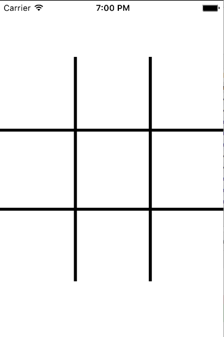
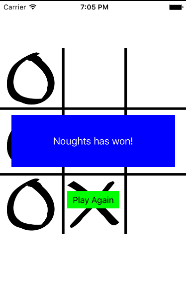

# iOS-tic-tac-toe
iOS Tic-Tac-Toe 2 Player game built with Swift

#Overview
This is a classic 2 player Tic Tac Toe game built on Swift.

#How the game works
Tic-tac-toe (also known as Noughts and crosses or Xs and Os) is a paper-and-pencil game for two players, X and O, who take turns marking the spaces in a 3×3 grid. The player who succeeds in placing three of their marks in a horizontal, vertical, or diagonal row wins the game.

#Screenshots

